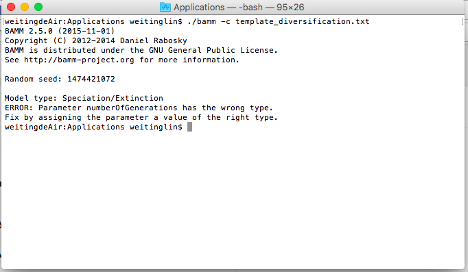

# How to use BAMM
## Install on Mac 
#### For detail see the [original document](http://bamm-project.org/settingup.html#bammsetup)
1. download the programm from [here](http://bamm-project.org/download.html)
2. Move the **.tar.gz** file to falder **Application**
3. Open the terminal
4. cd to the **Application** folder
5. type `ls` to make sure the **.tar.gz** file is there
6. type `tar -xzf bamm-2.5.0-MacOSX.tar.gz`. If error occur, check the returned file name from step **5**. 
7. create a **control file** ([Here for detail](http://bamm-project.org/quickstart.html))
8. type `./bamm -c template_diversification.txt `. Should see something like this:

## Prepare the control file

## Prepare the tree file
use this terminal command to  download tree data from url. (and rename it as **mytree.tre**)
`curl -o mytree.tre http://bamm-project.org/_downloads/whaletree.txt
`

## Run BAMM

## Analyse BAMM results in R

## Tips
### 1. Usefull commands in terminal
* `ls`
* `cd`
* `clear`
* `curl`
* `cp`
* `mv`

   